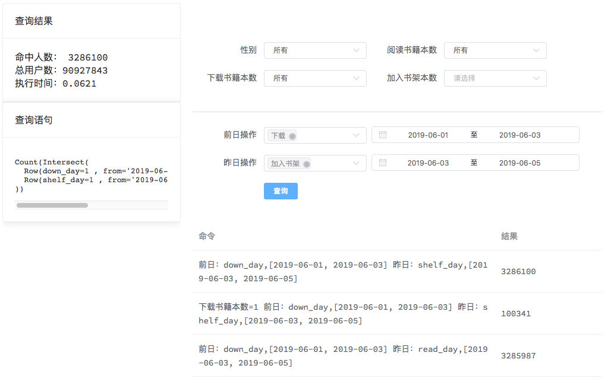

这是一个简单的`pilosa`验证程序。

使用千万日活验证`pilosa`存储和查询效率。

环境：
---
- go
- [pilosa](https://www.pilosa.com)
- python3/pypy 用于生成测试数据

安装：
---
```
git clone https://github.com/luw2007/pilosa_books
# 如果没有pypy 请执行 python3 tools/fake.py
make fake
make install
```

执行`pilosa_books`，然后打开浏览器查看[http://localhost:8000/](http://localhost:8000/)

QA:
---
1. 如果看到：` 2019/06/05 17:20:35 getting new server: client.EnsureIndex: Error: No usable addresses in the cluster`，
请检查是否启动了`pilosa`并且执行了`make fake`。

截图:
---


